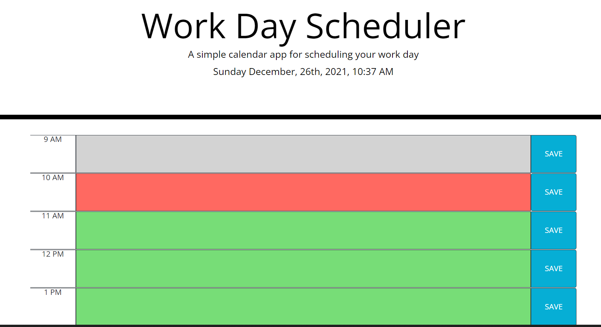

# Work-Day-Scheduler

[Workday Scheduler]( https://tooqk4u.github.io/Work-Day-Scheduler/)

The assignment was to create a program that can be used to plan a persons schedule for during the week. This Daily Scheduler provides a one day calendar with time blocks of the workday (between 9am-6pm). The top of the calendar displays the current day. When a user enters a task in an hour block and hits the save button, the task saves to local storage. Time blocks are color coded based on current time. Current hour block will appear red, all past time blocks will be grey, and future time blocks will be green.

This weeks project focused on utilizing JQuery and Bootstrap building upone the HTML, CSS and Javascript concepts. We used the legacy API MomentJs for date and time and utilized local storage in the browser to complete the objective.

Languages HTML, CSS, JavaScript with the implementation of third-party APIs (Bootstrap, MomentJs, JQuery) Languages.